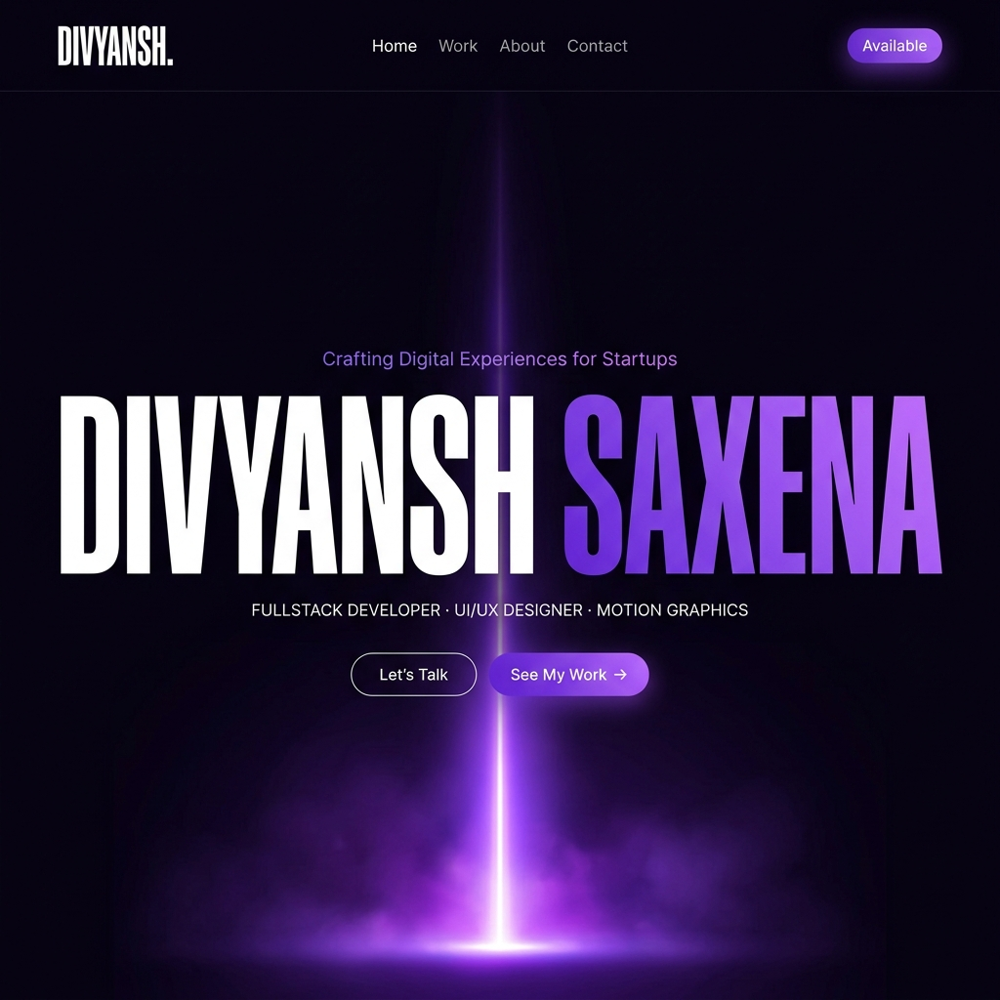

<div align="center">
  
  
  # SYNTAX STUDIO
  ### Crafting Digital Experiences for Startups, Founders & Brands
  
  **Divyansh Saxena**  
  *Fullstack Developer · UI/UX Designer · Motion Graphics*
  
  [Live Demo](https://divyanshsaxena.com) · [LinkedIn](https://linkedin.com/in/divyanshsaxena) · [GitHub](https://github.com/Divyansh-2903)
</div>

---

## ⚡ The Ethos
This isn't just a portfolio; it's a high-performance interactive storytelling engine. Built with a focus on **Andy's craft** and **Nikola's conversion depth**, it combines editorial-grade typography with 3D/motion layers to create a memorable brand identity.

## 🛠️ The Arsenal
The tech stack chosen for maximum performance and visual fidelity:

- **Frontend:** React 19, TypeScript, Vite
- **Animations:** Framer Motion, GSAP (ScrollTrigger)
- **Visuals:** Three.js, Spline 3D, Tailwind CSS 4
- **Content:** Sanity CMS (Headless)
- **Experience:** Lenis Scroll, Lucide Icons, Custom Cursors

## 🚀 Key Projects
- **OneClip Hub:** A multi-platform media command center (Web, Tauri, Android).
- **Flux IDE:** Cinematic landing page for developer tools.
- **Syntax Website:** The dark, editorial anchor for the Syntax brand.
- **Horizon HR:** AI-powered candidate funnel automation concept.

## 📦 Services Provided
- **Fullstack Development:** Building production-grade apps with React/Next.js.
- **UI/UX Design:** Pixel-perfect interfaces designed in Figma/Framer.
- **Motion Graphics:** High-end video editing and After Effects animation.
- **Digital Strategy:** Growth-focused content and SEO strategy.

## 🛠️ Local Development

1. **Clone the repo:**
   ```bash
   git clone https://github.com/Divyansh-2903/Portfolio.git
   ```

2. **Install dependencies:**
   ```bash
   npm install
   ```

3. **Configure Environment:**
   Create a `.env.local` and add your Sanity/API keys (see `.env.example`).

4. **Run Dev Server:**
   ```bash
   npm run dev
   ```

---

<div align="center">
  <p>Built with precision in Jaipur, India 🇮🇳</p>
  <p>© 2026 Syntax Studio</p>
</div>
